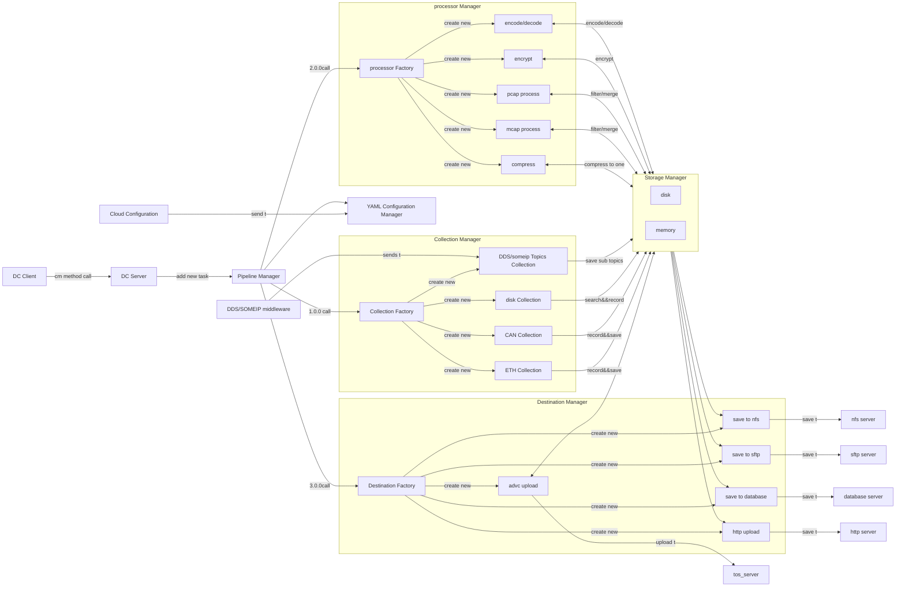

# Data Collection

```mermaid
flowchart LR
    dc_server["DC Server"]
    dc_client["DC Client"]
    dc_client--cm method call-->dc_server
    sub_pub_middleware["DDS/SOMEIP  middleware"]

    subgraph c_m["Collection Manager"]
        direction LR
        col_fac["Collection Factory"]
        col_topics_out["DDS/someip Topics Collection"]
        col_net["ETH Collection"]
        col_can["CAN Collection"]
        col_disk["disk Collection"]
    end
    subgraph p_m["processor Manager"]
        direction LR
        p_fac["processor Factory"]
        p_compress["compress"]
        p_mcap["mcap process"]
        p_pcap["pcap process"]
        p_encrypt["encrypt"]
        p_endecode["encode/decode"]
    end

    subgraph pipeline["Pipeline Manager"]
        direction LR
    end

    subgraph d_m["Destination Manager"]
        direction LR
        dest_factory["Destination Factory"]
        advc_upload["advc upload"]
        nfs_save["save to nfs"]
        sftp_save["save to sftp"]
        db_save["save to database"]
        http_upload["http upload"]
    end

    subgraph storage["Storage Manager"]
        direction LR
        disk["disk"]
        memory["memory"]
    end
    
    yaml_param["YAML Configuration Manager"]
    cloud_config["Cloud Configuration"]
    cloud_config --send to-->yaml_param
    pipeline-->yaml_param

%%    pipeline--loads-->yaml_param
%%    c_m--loads-->yaml_param
%%    d_m--loads-->yaml_param
%%    p_m--loads-->yaml_param


    dc_server --add new task-->pipeline

    pipeline--1.0.0 call-->col_fac
    col_fac--create new-->col_net--record&&save-->storage
    col_fac--create new-->col_can--record&&save-->storage
    col_fac--create new-->col_disk--search&&record-->storage
    col_fac--create new-->col_topics_out--save sub topics-->storage
    sub_pub_middleware--sends to-->col_topics_out
    
    pipeline--2.0.0call-->p_fac
%%    pipeline-->pipeline
    p_fac--create new-->p_compress<--compress to one-->storage
    p_fac--create new-->p_mcap<--filter/merge-->storage
    p_fac--create new-->p_pcap<--filter/merge-->storage
    p_fac--create new-->p_encrypt<--encrypt-->storage
    p_fac--create new-->p_endecode<--encode/decode-->storage
    pipeline--3.0.0call-->dest_factory
    advc_upload<-->storage
    storage-->nfs_save
    storage-->sftp_save
    storage-->db_save
    storage-->http_upload
    dest_factory--create new--> advc_upload
    dest_factory--create new--> nfs_save
    dest_factory--create new--> sftp_save
    dest_factory--create new--> db_save
    dest_factory--create new--> http_upload

    advc_upload--upload to-->tos_server
    nfs_save--save to-->nfs_server["nfs server"]
    sftp_save--save to-->sftp_server["sftp server"]
    db_save--save to-->db_server["database server"]
    http_upload--save to-->http_server["http server"]

%%    c_m-->p_m-->d_m

%%    sub_pub_middleware--sends to-->col_topics_out
```

